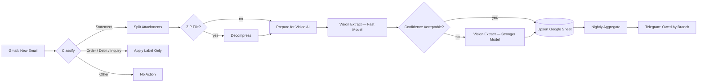

<div align="center">

# 🧾 AP Autopilot

**Turns scanned, inconsistent supplier statements into clean spreadsheet data automatically — with a nightly Telegram summary of exactly who you owe.**

[](https://n8n.io/)
[](https://openrouter.ai/)
[](https://www.google.com/sheets/about/)
[](https://core.telegram.org/bots/api)
[](./LICENSE)

</div>

---

## The problem

A multi-branch hardware business gets supplier statements by email — PDFs showing what each branch owes, aged into Current/30/60/90/120+ day buckets. Half of them are **scanned images with no selectable text**, layouts differ supplier to supplier, and someone has to read every one by hand to know what's actually owed and to whom. Miss one, and a payment slips through — or gets paid twice.

## What this does

Two coordinated n8n workflows:

1. **Ingest & Extract** (event-driven) — watches Gmail, classifies every incoming email (Statement / Order / Debit / Inquiry / Other), and for statements, runs vision AI to read the PDF — even scanned or handwritten ones — into structured, validated rows in Google Sheets.
2. **Nightly Digest** (scheduled) — every night, aggregates the sheet and sends a short Telegram message: total owed per branch, top creditors, and how many statements couldn't be parsed automatically.



## Why this is engineered, not a script

- **Cost-aware two-tier extraction.** A cheap, fast vision model reads every statement first. Only the ones it's genuinely unsure about — low confidence, or a branch it can't confidently match — escalate to a stronger, pricier model. Easy statements stay cheap; hard ones still get read correctly.
- **Idempotent by design.** Every row upserts on `branch + supplier + statement_date` — a re-sent statement updates the existing row instead of creating a duplicate, so the totals are never inflated by resend noise.
- **Reconciliation, not blind trust.** If the aging buckets don't sum to the stated total, the row is flagged with a confidence penalty and a note — not silently accepted.
- **Nothing vanishes.** A failed extraction, a ZIP with no usable files, an unmatched branch — every one of these still writes a row marked "Needs Manual," so a hard document is a task on a list, never a silently lost statement.
- **Handles the messy real world.** Multi-attachment emails, ZIP archives, scanned/handwritten PDFs, and inconsistent supplier layouts are all first-class cases, not edge cases bolted on later.

## Tech stack

`n8n` · `OpenRouter` (Gemini 2.5 Flash + Pro, Claude Haiku) · `Gmail API` · `Google Sheets API` · `Telegram Bot API`

## Repository contents

```
ap-autopilot/
├── README.md               <- you are here
├── build-brief.md          <- original business requirements this was built from
├── plan.md                 <- node-by-node build plan, decisions, and open questions
└── credentials.md          <- credential setup checklist
```

The docs above cover every node, prompt, and decision in full detail. The raw importable `.json` workflow exports are kept in a private repo and available for client engagements — [message me on WhatsApp](https://wa.me/+8801796553402) if you'd like the working files rather than just the write-up.

---

<div align="center">

## 💬 Want something like this built for your business?

I build production-grade n8n automation systems — not demos, systems that handle the messy edge cases, get tested before they go live, and keep working after handoff.

[](https://wa.me/+8801796553402)
[](https://github.com/raufnir)

**More automation builds:** [never-miss-a-lead](https://github.com/raufnir/never-miss-a-lead) · [shopkeeper-copilot](https://github.com/raufnir/shopkeeper-copilot) · [cod-rto-reduction-system](https://github.com/raufnir/cod-rto-reduction-system)

</div>
